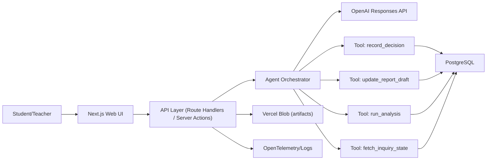

# 과학 탐구 활동 지원 AI 에이전트 앱 설계·구현 딥리서치 (Vercel + OpenAI API)

작성일: 2026-03-06
문서 목적: 바로 구현 가능한 수준의 기술 스택, 아키텍처, 보안, 운영 기준을 정의

## 1. 제품 목표와 설계 원칙

목표
- 학생이 AI와 대화하며 과학 탐구를 수행한다.
- 탐구 중 발생한 의사결정을 구조화해 자동 누적한다.
- 결과 보고서를 단계별로 자동 생성/버전관리한다.
- 교사/연구자가 과정 데이터로 학습 분석(과정 중심 평가)을 할 수 있다.

설계 원칙
- 상태 기반: 탐구 단계를 상태머신으로 강제해 품질과 재현성 확보
- 툴 최소권한: 모델이 임의 DB/파일 접근을 하지 못하도록 화이트리스트 도구만 허용
- 구조화 우선: 모델 출력은 JSON Schema 기반 Structured Output을 기본으로 사용
- 이벤트 소싱: 최종 보고서뿐 아니라 의사결정 이벤트를 원본 데이터로 보존
- 관측 가능성: 요청-에이전트-툴-DB를 trace로 연결해 디버깅 가능하게 설계

---

## 2. 권장 기술 스택 (프로덕션 기준)

런타임/프레임워크
- Next.js App Router (TypeScript)
- Node.js 20 LTS 이상
- 배포: Vercel (Serverless Functions)

AI 계층
- OpenAI Responses API (기본)
- Structured Outputs + Tool Calling
- (선택) Vercel AI SDK: 모델 호출/스트리밍/툴 오케스트레이션 추상화

데이터 계층
- PostgreSQL (Neon/Supabase 등 Vercel Marketplace 연동)
- ORM: Prisma
- 마이그레이션: Prisma Migrate
- 파일 저장: Vercel Blob (민감 파일은 Private Blob 우선)

인증/권한
- Auth.js(구 NextAuth.js) 또는 Better Auth
- 세션: HttpOnly + Secure cookie
- 권한: RBAC (student, teacher, admin)
- DB 레벨 격리: PostgreSQL Row-Level Security(RLS)

품질/운영
- Validation: Zod
- 테스트: Vitest + Playwright + 계약 테스트(JSON Schema)
- 관측성: OpenTelemetry + Vercel Observability
- 비밀정보: Vercel Environment Variables + 키 로테이션

---

## 3. 참조 아키텍처 (권장안)



핵심 분리
- UI 계층: 대화/탐구 캔버스/보고서 편집 뷰
- API 계층: 인증, 요청 검증, 속도 제한, 에이전트 실행 트리거
- Agent Orchestrator 계층: 모델 호출, 툴 실행 정책, 재시도, 실패 복구
- Data 계층: 이벤트 로그/현재 상태/보고서 버전/첨부 산출물

---

## 4. 에이전트 내부 설계 (심화)

### 4.1 상태머신 기반 탐구 오케스트레이션

탐구 단계(예시)
1. 문제 정의
2. 가설 수립
3. 실험 설계
4. 데이터 수집
5. 데이터 분석
6. 결론 도출
7. 보고서 완성

상태 전이 규칙 예시
- `problem_definition -> hypothesis`는 최소 1개 연구 질문이 구조화 저장되어야 허용
- `experiment_design -> data_collection`은 변수/통제조건/측정방법 필드가 모두 채워져야 허용
- `analysis -> conclusion`은 근거 데이터 참조(`artifact_id[]`)가 존재해야 허용

### 4.2 에이전트 실행 루프

1. `get_state`로 현재 단계와 결손 정보 확인  
2. 모델에 "현재 단계에서 필요한 다음 행동"만 요청  
3. 모델이 툴 호출하면 서버가 스키마 검증 후 실행  
4. 툴 결과를 모델에 반환해 다음 응답 생성  
5. `decision_events`와 `conversation_messages`를 원자적으로 저장  

### 4.3 툴 설계 원칙

- 툴은 작은 단위로 분해 (`record_decision`, `append_evidence`, `generate_report_section`)
- 각 툴 입력은 엄격한 JSON Schema + 서버측 재검증
- 툴은 멱등성 키(`idempotency_key`) 지원
- 고위험 툴(삭제/외부전송)은 인간 승인(HITL) 없이는 금지

---

## 5. 데이터 모델 (구현형)

핵심 테이블
- `users(id, email, role, created_at, last_login_at)`
- `inquiries(id, user_id, title, subject, status, current_stage, created_at, updated_at)`
- `conversation_messages(id, inquiry_id, role, content, model, token_usage, created_at)`
- `decision_events(id, inquiry_id, stage, decision_type, payload_json, created_at, actor)`
- `report_versions(id, inquiry_id, version_no, report_md, report_json, created_at, created_by)`
- `artifacts(id, inquiry_id, blob_url, mime_type, size_bytes, checksum, created_at)`
- `agent_runs(id, inquiry_id, run_status, model, started_at, ended_at, error_code, trace_id)`

권장 인덱스
- `conversation_messages(inquiry_id, created_at desc)`
- `decision_events(inquiry_id, stage, created_at desc)`
- `report_versions(inquiry_id, version_no desc)`

트랜잭션 규칙
- "툴 실행 결과 저장 + 메시지 저장"은 단일 트랜잭션
- 보고서 버전 증가는 낙관적 락(버전 충돌 시 재시도)

---

## 6. OpenAI API 적용 전략 (2026 기준)

핵심 선택
- 기본 API: Responses API
- 출력 제어: Structured Outputs(JSON Schema)
- 실행 제어: Tool Calling(화이트리스트 툴만 노출)

중요한 구현 포인트
- 모델 응답을 신뢰하지 말고 서버에서 스키마 재검증
- 단계별 시스템 프롬프트를 분리(문제정의/가설/실험/분석/결론)
- `parallel_tool_calls`는 스키마 안정성 필요 시 비활성화 검토
- 장기 컨텍스트는 전부 프롬프트에 넣지 말고 요약+상태조회 툴로 관리

주의 사항
- Assistants API는 종료 일정(2026-08-26)이 명시되어 있어 신규 개발은 Responses API 중심으로 설계

---

## 7. 보안/안전/신뢰성 아키텍처

위협 모델
- Prompt Injection
- 데이터 누출(타 학생 데이터 접근)
- 툴 오남용(의도치 않은 상태 변경)
- 환각 기반 잘못된 과학 결론

대응 계층
1. 입력 계층: 길이 제한, 금칙 패턴, 파일/URL sanitize
2. 프롬프트 계층: 지시와 데이터 분리, 시스템 규칙 고정
3. 툴 계층: allowlist, 인자 검증, role 기반 실행 제한
4. 데이터 계층: RLS, 최소 권한 DB 계정, 민감정보 암호화
5. 출력 계층: 보고서 생성 시 근거 참조 강제(출처 없는 주장 차단)
6. 운영 계층: 감사 로그, 이상행동 탐지, incident runbook

교육 도메인 추가 가드레일
- 미성년자 개인정보 최소 수집
- 위험 실험(화학/전기/화재) 자동 안전 경고 정책
- 교사 승인 워크플로(고위험 주제/외부 공개 전)

---

## 8. 관측성/평가(Evals)/품질 관리

관측성
- 모든 요청에 `trace_id` 부여
- 스팬 분해: `ui_request -> agent_plan -> tool_call -> db_write`
- 모델 비용/지연/실패율 대시보드화

Evals 체계(최소 세트)
- 단계 정확도: 현재 단계에 맞는 질문/가이드 제시 비율
- 구조 정확도: JSON Schema 검증 통과율
- 근거성: 결론 문장 중 evidence reference 포함 비율
- 안정성: 동일 입력 재실행 시 결과 일관성
- 안전성: 프롬프트 인젝션/우회 공격 방어율

테스트 전략
- 단위 테스트: 툴 함수와 상태 전이 함수
- 계약 테스트: 모델 출력 스키마/툴 인자 스키마
- 통합 테스트: "학생 대화 1세션 전체" 시나리오
- 회귀 테스트: 실패했던 프롬프트/데이터셋 고정 벤치

---

## 9. 폴더 구조 (실행 가능한 형태)

```text
src/
  app/
    (auth)/
      login/
    inquiry/[id]/
    api/
      agent/route.ts
      reports/route.ts
      artifacts/route.ts
  components/
    inquiry/
    report/
    common/
  lib/
    agent/
      orchestrator.ts
      prompts/
      tools/
      state-machine.ts
      schemas.ts
    db/
      client.ts
      repositories/
    security/
      guardrails.ts
      authz.ts
    observability/
      tracing.ts
  types/
    domain.ts
    api.ts
prisma/
  schema.prisma
  migrations/
tests/
  unit/
  integration/
  evals/
docs/
  architecture.md
  threat-model.md
  runbook.md
```

---

## 10. 단계별 구현 로드맵 (전문 개발자 버전)

Phase 1. Foundation (1주)
- Next.js/TypeScript/Prisma/Auth 기본 골격
- DB 스키마 + 마이그레이션 + 시드 데이터
- 로그인/권한/RLS 적용

Phase 2. Agent Core (1~2주)
- 상태머신 구현
- Responses API + Structured Outputs + 기본 툴 4종
- 대화 저장/의사결정 이벤트 저장/보고서 초안 반영

Phase 3. Reliability (1주)
- 재시도/타임아웃/멱등성/실패 복구
- 관측성(OTel), 비용/지연 모니터링
- 보안 필터/프롬프트 인젝션 대응

Phase 4. Quality & Research (지속)
- eval 셋 구축(학년/과목별)
- 교사 피드백 루프 반영
- 탐구 성과 지표(과정 참여도, 근거 기반 결론률) 실험

---

## 11. 연구 확장 주제 (심화)

- Human-AI 공동조절(Co-regulation) 모델: 학생 주도성 vs AI 개입 강도 최적화
- 메타인지 지원: "왜 이 결론인가?"를 설명하는 반성 프롬프트 자동 삽입
- 다중 에이전트 구조: 코치/검증자/안전감시자 분리
- 학습 분석: 이벤트 로그 기반 탐구 역량 프로파일링
- 정책 준수 자동화: 학교/교육청 가이드라인을 룰엔진으로 반영

---

## 12. 참고한 주요 1차 출처 (2026-03-06 확인)

- OpenAI Structured Outputs: https://developers.openai.com/api/docs/guides/structured-outputs
- OpenAI Function Calling: https://developers.openai.com/api/docs/guides/function-calling
- OpenAI Responses API 마이그레이션: https://developers.openai.com/api/docs/guides/migrate-to-responses
- OpenAI Production Best Practices: https://developers.openai.com/api/docs/guides/production-best-practices
- OpenAI Evals 가이드: https://developers.openai.com/api/docs/guides/evals
- Vercel AI SDK: https://vercel.com/docs/ai-sdk
- Vercel Blob: https://vercel.com/docs/vercel-blob
- Vercel Postgres(마켓플레이스 연동): https://vercel.com/docs/postgres
- Next.js Authentication Guide (업데이트 2026-02-11): https://nextjs.org/docs/app/guides/authentication
- PostgreSQL Row Security Policies: https://www.postgresql.org/docs/current/ddl-rowsecurity.html
- OWASP LLM Prompt Injection Prevention Cheat Sheet: https://cheatsheetseries.owasp.org/cheatsheets/LLM_Prompt_Injection_Prevention_Cheat_Sheet.html
- NIST AI RMF Generative AI Profile (NIST AI 600-1): https://www.nist.gov/publications/artificial-intelligence-risk-management-framework-generative-artificial-intelligence
